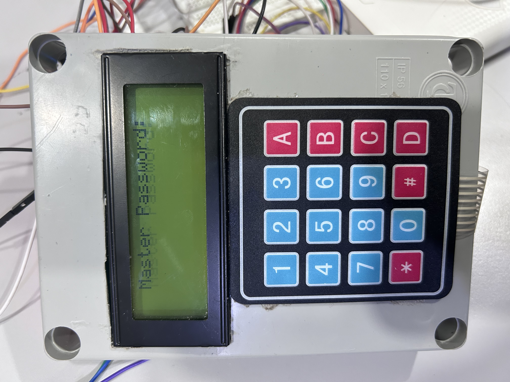
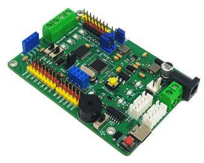
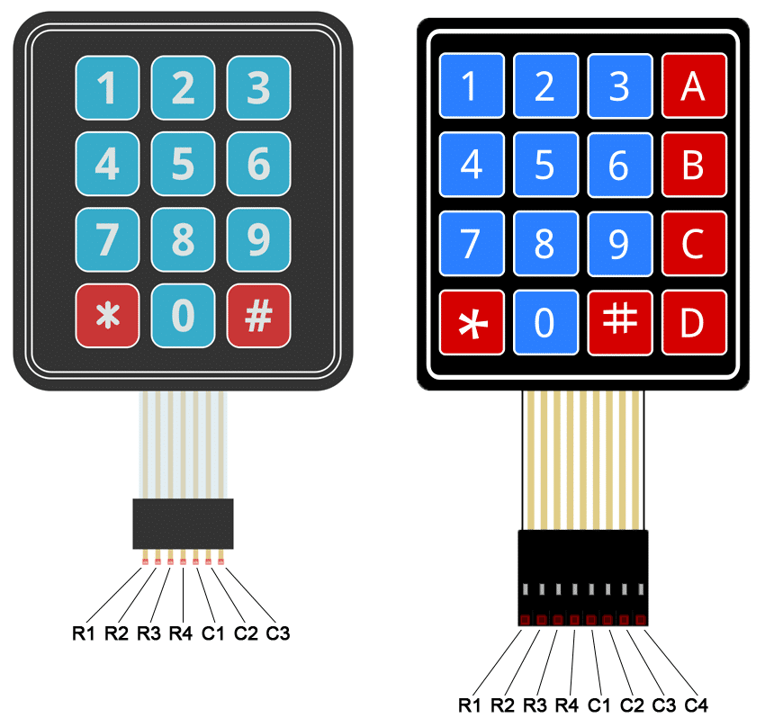
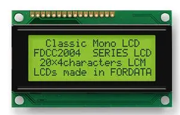
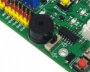
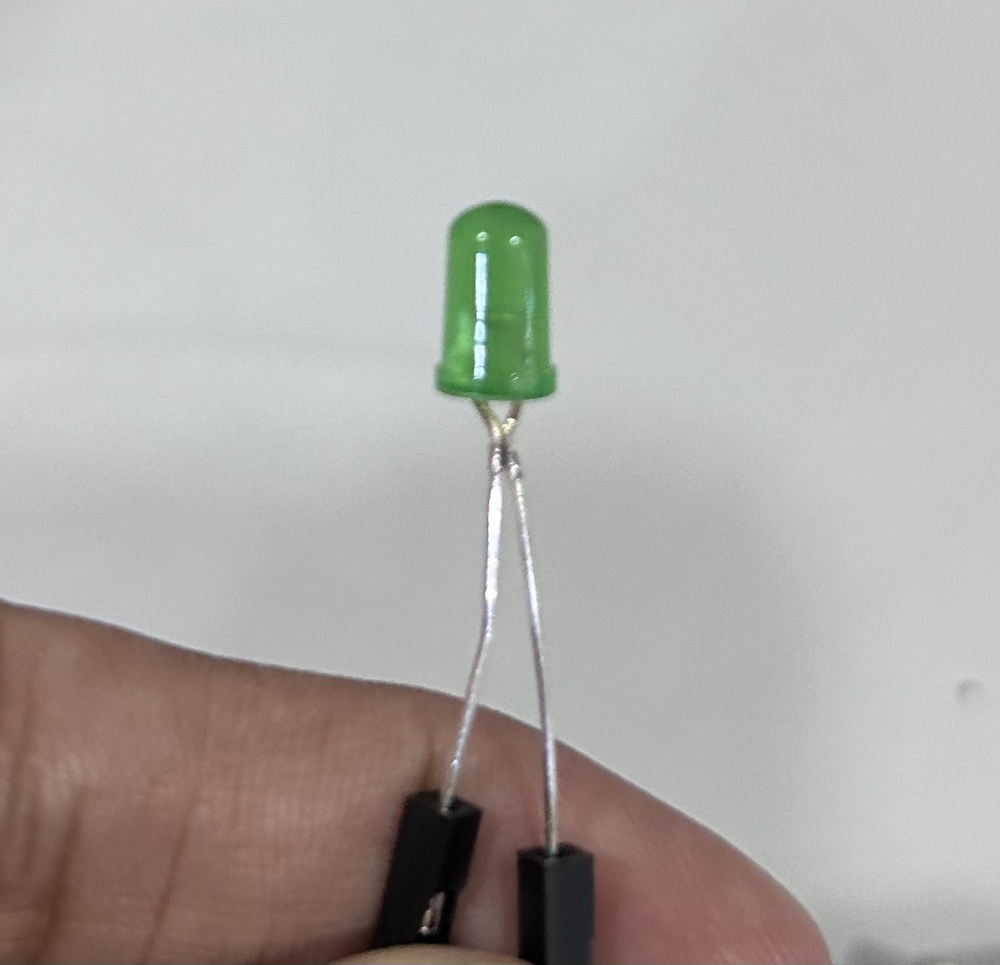

# Locker Controller System

<br/><br/>

<br/>
<small>Arduino Uno Durian</small>
<br/>
<br/>
Language: Dwibahasa (Malay - English)

## Penerangan Sumber Kod Terbuka: Locker Controller System

### Libraries

1. Library untuk LCD-I2C, Keypad dan Servo. Wajib import library ini
```c
#include <Wire.h>
#include <LiquidCrystal_I2C.h>
#include <Keypad.h>
#include <Servo.h>
```

### Master Password
---
1. Di sini terletak memori untuk master password
2. Tujuan untuk pengguna mengesahkan password yang dimasukkan melalui keypad
3. Boleh edit semula master password di sini

```c
const char master_password[] = "134679";
```

### Keypad
---
1. Keypad yang digunakan adalah dimensi 4x4
2. Rows = 4, Columns = 4

```c
const int ROWS = 4;
const int COLS = 4;
```

3. Kedudukan nombor dan huruf dalam keypad menggunakan kaedah Array (Matrix 2 dimensi)
```c
char keys[ROWS][COLS] = {
  {'1','2','3','A'},
  {'4','5','6','B'},
  {'7','8','9','C'},
  {'*','0','#','D'}
};
```

### Panduan pemasangan Arduino ke Keypad
1. Pin arduino yang dipasangkan ke arah keypad
2. Rujuk gambarajah diagram keypad

</img>

3. Pin Arduino ke keypad
```c
byte rowPins[ROWS] = {13, 12, 11, 10}; // R1, R2, R3, R4
byte colPins[COLS] = {9, 8, 7, 6}; // C1, C2, C3, C4

Keypad keypad = Keypad(makeKeymap(keys), rowPins, colPins, ROWS, COLS);
```

### Liquid Crystal Display (LCD) 20x4
---
<center>

</center>

1. Set alamat LCD
2. Boleh guna kod I2C Scanner pada arduino IDE untuk mengimbas alamat LCD
```c
int lcdAddress = 0x27; // 0x27 adalah alamat LCD yang telah diimbas
```

### Menentukan Rows dan Columns LCD
```c
int lcdColumns = 20;
int lcdRows = 4;

LiquidCrystal_I2C lcd(lcdAddress, lcdColumns, lcdRows);
```

### Buzzer (Arduino UNO attached)
---

<br/>
<small>Buzzer yang telah dipasangkan ke board Arduino</small>

<br/>

Buzzer pada arduino telah dipasangkan kepada pin nombor 4. Jadi, tinggal nak declare pin mana buzzer itu dihubungkan.

```c
const int buzzerPin = 4;
```

### Light Emitting Diode (LED)
---


<br/>
<small>Light Emitting Diode (LED)</small>

LED Pin for Arduino

```c
const int LED1_Pin = 5;
const int LED2_Pin = 3;
const int LED3_Pin = A2;
```

